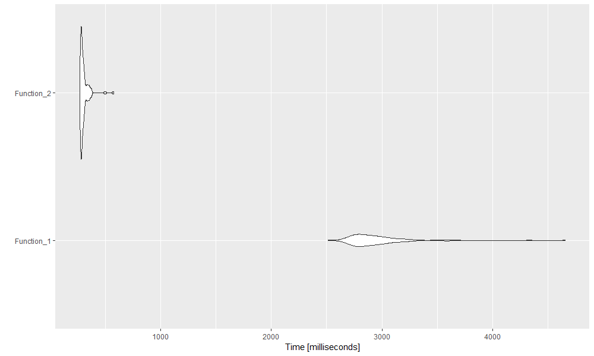
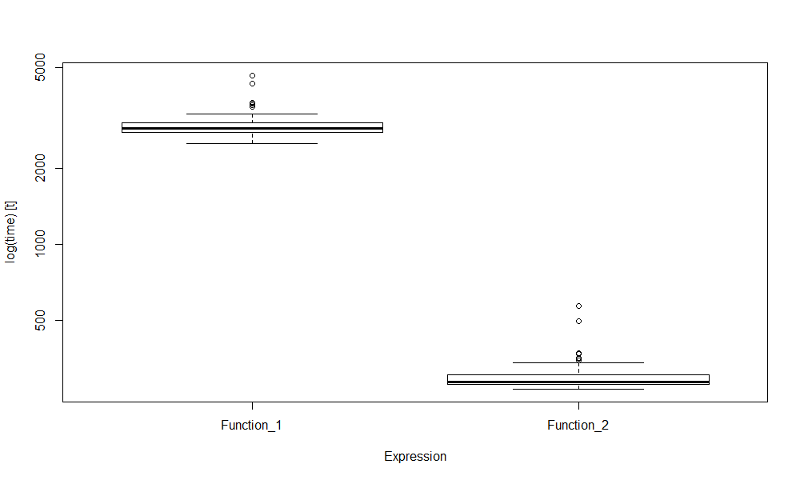

## TABLE OF CONTENT
  1. Introduction
  
  2. Functions description
  
  3. The use of functions and efficiency comparision
  
  4. Code profiling
  
  5. Conclusions


#I. INTRODUCTION

## Introduction

  * Purpose: functions to apply double volatility breakout techniques on a time series of asset prices.
  
  * Function arguments include: data, type of MA, type of Volatility, window size of MA and Volatility, multipliers, transaction cost (as %) and strategy.
  
  * The function:
      * returns a list of result include: Sum Gross PnL, Sum Net PnL, no. of transactions, Gross SR, Net SR
      
      * plots 3 graphs: 1 graph of signal together with entry and exit thresholds, 1 graph of Gross and Net PnL, 1 graph of position taken during the period.


#II. FUNCTIONS DESCRIPTION

## Functions description
  
**Similarity**
  
```{r, echo = F, warning = F, message = F}
library(knitr) # for nicely looking tables in html files
library(kableExtra) # for even more nicely looking tables in html files

Similarity <- data.frame (Check_input = "Assertion",
                          Signal_generation = "For loop and if conditions",
                          Plot_graphs = "Plot function",
                          stringsAsFactors = FALSE
                          ) 
                                
column_spec(
kable_styling(kable(Similarity, 
                    "html", 
                    digits = 2,
                    align = "r"),
              font_size = 20),
              1:3, width = "30em")

```

  
**Difference**
  
```{r, echo = F, warning = F, message = F}

Difference <- data.frame (Functions = c("Function_1", "Function_2"),
                          SMA_cal = c("for loop", "runmean fun"),
                          EMA_cal = c("EMA R-fun", "written EMA C++-fun"),
                          SD_cal = c("for loop & map", "runsd fun"),
                          MAD_mean_cal = c("for loop & sapply", "runMAD fun"),
                          MAD_med_cal = c("for loop & sapply", "runMAD fun"),
                          GrossPnL_cal = c("map2 fun", "vector operation"),
                          NetPnL_cal = c("pmap fun", "vector operation"),
                          stringsAsFactors = FALSE
                          ) 
                                
column_spec(
kable_styling(kable(Difference, 
                    "html", 
                    digits = 2,
                    align = "r"),
              font_size = 20),
              1:8, width = "30em")

```


#III. THE USE OF FUNCTIONS & EFFICIENCY

## Function Use

```{r, echo = F, warning=F, message=F}
library(quantmod) 
library(caTools)
library(xts)
library(chron)
library(TTR)
library(knitr) 
library(kableExtra)
library(testit)
library(purrr)
library(urca)
library(quantreg)
library(timeSeries)
library(Rcpp)
library(rbenchmark)
library(microbenchmark)
library(profvis)
library(ggplot2)

load("all_myresult.RData")

```

**Function 1**

```{r, eval = F, warning = F, message = F}

Double_breakout_1 <- function(mydata, # a vector or matrix of stock or index price,
                              type_MA  = "EMA", # EMA or SMA
                              type_vol = "SD", # SD, MAD (around Mean), MADmed (around Median)
                              MA_size = 20, # window size for EMA,
                              Vol_size = 60, # window size for rolling standard deviation,
                              m = 2, # multiplier for entry threshold,
                              n = 1.5, # multiplier for exit threshold, should be lower than m
                              trans_cost = 0.0001, # as % of price
                              strategy) { #should be "mr" or "mom"
  
  assert("Input should be numeric",
         is.numeric(mydata))
  
  assert("Input parameters should be a xts object",
               is.xts(mydata))
  
  if(is.xts(mydata)){
  assert("Input parameters should be a matrix with 1 column",
         ncol(mydata)==1)
  }
    
  assert("Incorrect type of Moving Average. Please use 'EMA' or 'SMA'!",
         type_MA %in% c("EMA", "SMA"))
  
  assert("Incorrect type of Volatility. Please use 'SD', 'MAD' or 'MADmed'!",
         type_vol %in% c("SD", "MAD", "MADmed"))
  
  assert("Incorrect type of Strategy. Please use 'mom' or 'mr'!",
         strategy %in% c("mom", "mr"))
  
  assert("m should be greater than n",
         m > n)
  
  if(type_MA == "SMA"){
    
    MA <- rep(NA, length(mydata[,1]))
    for (i in seq(1, length(mydata[,1]) - MA_size + 1)){
      
      window_last_index = i + MA_size - 1
      MA[window_last_index] = mean(MA[i:window_last_index])
      
    }

  } else {
    
    MA <- EMA(na.locf(coredata(mydata[,1]), na.rm = FALSE), MA_size)
    
  }
  
  if(type_vol == "SD"){
    
    Vol <- rep(NA, length(mydata[,1]))
    
    for (i in seq(1, length(mydata[,1])  - Vol_size + 1)){
      
      myvec <- coredata(mydata[c(i:(i + Vol_size - 1)),1])
      Vol[i + Vol_size -1] <- ((myvec %>% 
                                map_dbl (~ (.x - mean(myvec))**2 ) %>% 
                                 sum())/(Vol_size-1)) %>% 
                                  sqrt()
      
    }
    
    
  } else if (type_vol == "MAD"){
    
    Vol <- rep(NA, length(mydata[,1]))

    for (i in seq(1, length(mydata[,1])  - Vol_size + 1)){

      myvec <- coredata(mydata[c(i:(i + Vol_size - 1)),1])

      Vol[i + Vol_size -1] <- (myvec %>%
                                  sapply (function(x) {abs(x - mean(myvec))} ) %>%
                                  sum())/Vol_size

    }
    
  } else {
    
    Vol <- rep(NA, length(mydata[,1]))
    
    for (i in seq(1, length(mydata[,1])  - Vol_size + 1)){
      
      myvec <- coredata(mydata[c(i:(i + Vol_size - 1)),1])
      
      Vol[i + Vol_size -1] <- (myvec %>%
                                 sapply (function(x) {abs(x - median(myvec))} ) %>%
                                 sum())/Vol_size
      
    }
                  
  }
  
  signal <- as.vector(mydata[,1])
  lower.entry = MA - m * Vol
  upper.entry = MA + m * Vol
  lower.exit =  MA - n * Vol
  upper.exit = MA + n * Vol
  
  # lets first create a vector of 0s
  position <- rep(0, length(signal))
  
  for (i in 2:length(signal)){
    # check if values are nonmissing (otherwise calculations not possible)
    if (!is.na( signal[i-1] ) & 
        !is.na( upper.entry[i-1] ) & 
        !is.na( lower.entry[i-1] ) &
        !is.na( upper.exit[i-1] ) & 
        !is.na( lower.exit[i-1] )
    )
    { 
      # what if previous position was 0
      if (position[i-1] == 0){
        if ( signal[i-1] > upper.entry[i-1] ) { position[i] <- 1 }
        if ( signal[i-1] < lower.entry[i-1] ) { position[i] <- -1 }
      } else if (position[i-1]==1){
        # what if previous position was 1
        if ( signal[i-1] > lower.exit[i-1] ) { position[i] <- 1 }
        if ( signal[i-1] <= lower.exit[i-1]  &
             signal[i-1] >= lower.entry[i-1] ) { position[i] <- 0 }
        if ( signal[i-1] < lower.entry[i-1] ) { position[i] <- -1 }
      } else if (position[i-1]==-1){
        # what if previous position was -1
        if ( signal[i-1] < upper.exit[i-1] ) { position[i] <- -1 }
        if ( signal[i-1] >= upper.exit[i-1]  &
             signal[i-1] <= upper.entry[i-1] ) { position[i] <- 0 }
        if ( signal[i-1] > upper.entry[i-1] ) { position[i] <- 1 }
      }
      
    } else {position[i] <- position[i-1]}
    # if anything is missing, keep previous position
  }
  # reverse the position if we use a momentum ("mom") strategy
  if(strategy == "mr") position <- (-position)
  
  position[is.na(position)] <- 0
  
  gross.pnl <- map2_dbl(position, diff(mydata[,1]), function(x,y) {x*y})
  gross.pnl[is.na(gross.pnl)] <- 0
  
  ntrans <- abs(diff(position))
  ntrans <- c(0, ntrans)
  
  net.pnl = pmap_dbl(data.frame(gross.pnl, mydata[,1], ntrans), ~ ..1 - ..3*trans_cost*..2)

  
  print(
  plot(cbind(mydata[,1],
             upper.entry, upper.exit, 
             lower.entry, lower.exit),
       multi.panel = FALSE,
       main = "Signal and Thresholds",
       col = c("#6e7177", "#701717", "#065617", "#701717", "#065617"),
       major.ticks = "years",
       grid.ticks.on = "years",
       grid.ticks.lty = 3,
       cex = 1)
  
  )
  

  pnl <- as.xts(cbind(cumsum(gross.pnl),
                      cumsum(net.pnl)),
               index(mydata[,1]))
  colnames(pnl)[1:2] <- c("Gross.PnL", "Net.PnL")
  
  print(
  plot(pnl,
       multi.panel = FALSE,
       type = "l",
       main = "Gross and net PnL",
       col = c("#377EB8", "#E41A1C"),
       major.ticks = "years",
       grid.ticks.on = "years",
       grid.ticks.lty = 3,
       legend.loc = "topleft",
       cex = 1)
  )
  
  plot(position,
       main = "Position",
       type = "l",
       col = c("#a34c09"),
       cex = 1)
  
  mysummary <- list(SumGross = sum(gross.pnl),
                    SumNet = sum(net.pnl),
                    Ntrans = sum(ntrans),
                    GrossSR = mean(gross.pnl)/sd(gross.pnl)*sqrt(252),
                    NetSR = mean(net.pnl)/sd(net.pnl)*sqrt(252)
                    )

  # invisible(mysummary)
  
  return(mysummary)
  
} 

(f1 <- Double_breakout_1(SP500["2010/2018", 1], strategy = "mr"))

```

## Function Use  

**Function 2**

```{r, eval = F, warning = F, message = F}

Double_breakout_2 <- function(mydata, # a vector or matrix of stock or index price,
                              type_MA  = "EMA", # EMA or SMA
                              type_vol = "SD", # SD, MAD, MedAD
                              MA_size = 20, # window size for EMA,
                              Vol_size = 60, # window size for rolling standard deviation,
                              m = 2, # multiplier for entry threshold,
                              n = 1.5, # multiplier for exit threshold, should be lower than m
                              trans_cost = 0.0001, # as % of price
                              strategy) { #should be "mr" or "mom"
  
  assert("Input parameters should be numeric",
         is.numeric(mydata))
  
  assert("Input parameters should be a xts object",
         is.xts(mydata))
  
  if(is.xts(mydata)){
    assert("Input parameters should be a matrix with 1 column",
           ncol(mydata)==1)
  }
  
  assert("Incorrect type of Moving Average. Please use 'EMA' or 'SMA'!",
         type_MA %in% c("EMA", "SMA"))
  
  assert("Incorrect type of Volatility. Please use 'SD', 'MAD' or 'MADmed'!",
         type_vol %in% c("SD", "MAD", "MADmed"))
  
  assert("Incorrect type of Strategy. Please use 'mom' or 'mr'!",
         strategy %in% c("mom", "mr"))
  
  assert("m should be greater than n",
         m > n)
  
  if(type_MA == "SMA"){
    MA <- as.vector(runmean(coredata(mydata[,1]), 
                            MA_size, 
                            endrule = "NA", 
                            align = "right")
    )
    
  } else {
    MA <- myEMA(na.locf(coredata(mydata[,1]), na.rm = FALSE), MA_size)
    MA[1:MA_size] <- NA
    
  }
  
  if(type_vol == "SD"){
    Vol <- as.vector(runsd(na.locf(coredata(mydata[,1]), na.rm = FALSE), Vol_size, 
                           endrule = "NA", align = "right"))
    
  } else if (type_vol == "MAD"){
    
    Vol <- as.vector(runMAD(na.locf(coredata(mydata[,1]), na.rm = FALSE),
                            Vol_size,
                            center = runMean(na.locf(coredata(mydata[,1]), na.rm = FALSE), Vol_size),
                            constant = 1.0,
                            stat = "mean")
    )
    
  } else {
    Vol <- as.vector(runMAD(na.locf(coredata(mydata[,1]), na.rm = FALSE), 
                            Vol_size, 
                            stat = "mean")
    )
    
  }
  
  signal <- as.vector(mydata[,1])
  lower.entry = MA - m * Vol
  upper.entry = MA + m * Vol
  lower.exit =  MA - n * Vol
  upper.exit = MA + n * Vol
  
  # lets first create a vector of 0s
  position <- rep(0, length(signal))
  
  for (i in 2:length(signal)){
    # check if values are nonmissing (otherwise calculations not possible)
    if (!is.na( signal[i-1] ) & 
        !is.na( upper.entry[i-1] ) & 
        !is.na( lower.entry[i-1] ) &
        !is.na( upper.exit[i-1] ) & 
        !is.na( lower.exit[i-1] )
    )
    { 
      # what if previous position was 0
      if (position[i-1] == 0){
        if ( signal[i-1] > upper.entry[i-1] ) { position[i] <- 1 }
        if ( signal[i-1] < lower.entry[i-1] ) { position[i] <- -1 }
      } else if (position[i-1]==1){
        # what if previous position was 1
        if ( signal[i-1] > lower.exit[i-1] ) { position[i] <- 1 }
        if ( signal[i-1] <= lower.exit[i-1]  &
             signal[i-1] >= lower.entry[i-1] ) { position[i] <- 0 }
        if ( signal[i-1] < lower.entry[i-1] ) { position[i] <- -1 }
      } else if (position[i-1]==-1){
        # what if previous position was -1
        if ( signal[i-1] < upper.exit[i-1] ) { position[i] <- -1 }
        if ( signal[i-1] >= upper.exit[i-1]  &
             signal[i-1] <= upper.entry[i-1] ) { position[i] <- 0 }
        if ( signal[i-1] > upper.entry[i-1] ) { position[i] <- 1 }
      }
      
    } else {position[i] <- position[i-1]}
    # if anything is missing, keep previous position
  }
  # reverse the position if we use a momentum ("mom") strategy
  if(strategy == "mr") position <- (-position)
  
  position[is.na(position)] <- 0
  
  gross.pnl <- ifelse(is.na(position * diff(mydata[,1])),
                      0,
                      position * diff(mydata[,1])
  )
  
  
  ntrans <- abs(diff(position))
  ntrans <- c(0, ntrans)
  
  net.pnl = gross.pnl - ntrans * (trans_cost * mydata[,1])
  colnames(net.pnl)[1] <- "Net.PnL"
  
  print(
    plot(cbind(mydata[,1],
               upper.entry, upper.exit, 
               lower.entry, lower.exit),
         multi.panel = FALSE,
         main = "Signal and Thresholds",
         col = c("#6e7177", "#701717", "#065617", "#701717", "#065617"),
         major.ticks = "years",
         grid.ticks.on = "years",
         grid.ticks.lty = 3,
         cex = 1)
  )
  
  pnl <- as.xts(cbind(cumsum(gross.pnl),
                      cumsum(net.pnl)),
                index(mydata[,1]))
  colnames(pnl)[1:2] <- c("Gross.PnL", "Net.PnL")
  
  print(
    plot(pnl,
         multi.panel = FALSE,
         type = "l",
         main = "Gross and net PnL",
         col = c("#377EB8", "#E41A1C"),
         major.ticks = "years",
         grid.ticks.on = "years",
         grid.ticks.lty = 3,
         legend.loc = "topleft",
         cex = 1)
  )
  
    plot(position,
         main = "Position",
         type = "l",
         col = c("#a34c09"),
         cex = 1)
  
  mysummary <- list(SumGross = sum(gross.pnl),
                    SumNet = sum(net.pnl),
                    Ntrans = sum(ntrans),
                    GrossSR = mean(gross.pnl)/sd(gross.pnl)*sqrt(252),
                    NetSR = mean(net.pnl)/sd(net.pnl)*sqrt(252)
  )
  
  # invisible(mysummary)
  
  return(mysummary)
  
} 

(f2 <- Double_breakout_2(SP500["2010/2018", 1], strategy = "mr"))

```


```{r, warning = F, message = F}

identical(f1, f2)

```

## Efficiency comparision

**Benchmark**
  
```{r, echo = F, warning=F, message=F}

compare_1

```

**Micro-benchmark**

```{r, echo = F, warning=F, message=F}

print(compare_2) 

```

## Efficiency comparision

**Autoplot**

```{r, echo = F, out.width ='100%'}



```

## Efficiency comparision

**Boxplot**

```{r, echo = F, out.width ='100%'}



```

#IV. CODE PROFILING

## Code profiling

**Function 1**

```{r, echo = F, warning = F, message = F}

profile_1

```

## Code profiling

**Function 2**

```{r, echo = F, warning = F, message = F}

profile_2

```


#V. CONCLUSION

## Conclusion

* Defensive programming is useful in handling input and error

* Operation with vector is more efficient than for loops and other vectorised functions (apply, map)

* The application of c++ function in R improves the efficiency of the code

#**THANK YOU FOR YOUR ATTENTION!**


